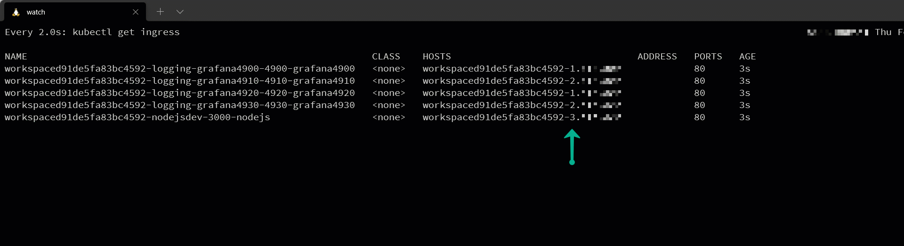

# Devworkspace Operator Multiple Endpoints failure

Devworkspace Operator keeps rotating numbers for ingress hosts in case of more than 3 public endpoints.

This repository contains a devfile that should cause the issue.

Relates to issue https://github.com/eclipse/che/issues/21224
